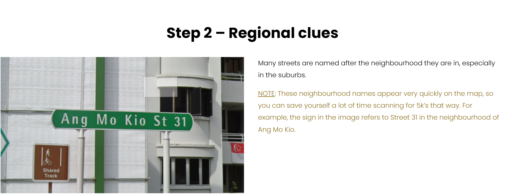
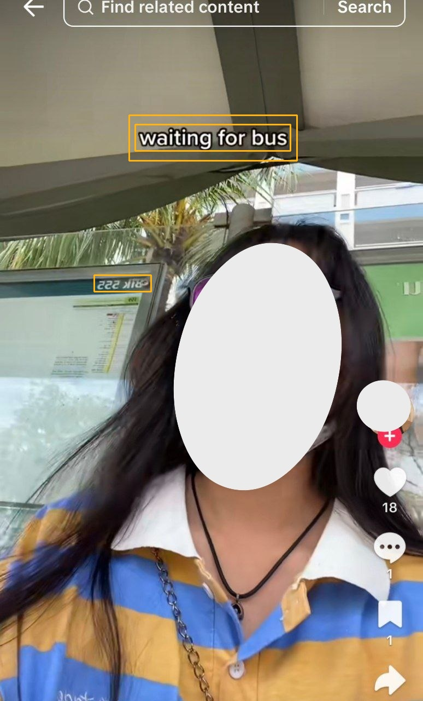
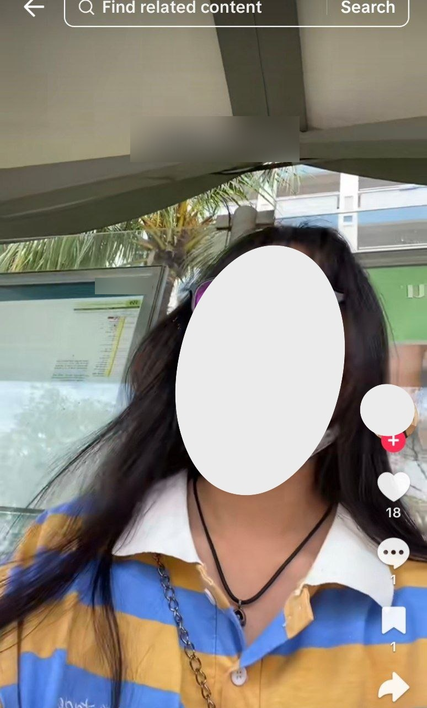

# Geo-Safely: GenAI Location Privacy


## The Problem

Have you ever shared a photo from a trip, a hangout, or just a casual day out, and then later realized that your background gave away more than you intended?  

With the rise of powerful AI models, turning off location services is no longer enough. A single image can reveal clues that most people overlook:  
- a distinctive **flag** fluttering in the corner,  
- the **block number** of an HDB,  
- a **street sign** with just enough detail,  
- or even a **school logo** on a banner.  



To a malicious individual, or even to a casual player of GeoGuessr, these are breadcrumbs that can be pieced together to identify your exact location.  

The difference is that while GeoGuessr is a game, in the real world this can have **serious consequences** from stalking to targeted harassment. That’s why we wanted to flip the game: instead of making it easier to guess your location, our tool makes it **harder by automatically blurring out those tell-tale signs**.  

This is a real, urgent privacy concern that we believe deserves a proactive solution.  

---

## Our Inspiration

The spark for this project came from a simple but important thought: *what if we could use AI to fight back against AI?*  

The very same technology that makes it possible to identify where someone is from a single photo can also be used to detect and remove those exact clues before the photo is shared.  

We see this risk every day in Singapore, where platforms like TikTok have fueled a wave of content creation among young people. Many users, especially female teenagers, are unaware of how much their videos reveal. A simple dance clip in front of an HDB block can unintentionally expose their exact location.  

This risk is not theoretical. In one tragic case in Pakistan, a TikTok star was stalked to her home by a man who had pieced together her location from her content. He eventually shot her dead. [Read more here.](https://www.scmp.com/news/asia/south-asia/article/3312973/teen-tiktok-star-shot-dead-stalker-pakistan)  

That case was a wake-up call: **social media exposure can be deadly.**  

👉 Our mission is simple: use AI not to *find* your location, but to *hide* it.  


---

## Before and After

Our system detects sensitive objects like signs, flags, and landmarks, and automatically blurs them out before sharing:  

<table>
  <tr>
    <td>
      
      <br>
      Original
    </td>
    <td>
      
      <br>
      Protected
    </td>
  </tr>
</table>


---

## Features

- Automatic Detection: Uses state-of-the-art vision-language models to identify sensitive objects such as street signs, landmarks, license plates, and flags.

- Privacy Filters: Offers multiple redaction methods (blur, mosaic, or noise masking) to obscure sensitive areas.

- Before/After Preview: Shows the original and redacted versions side-by-side so users understand what’s being removed.

- Seamless Mobile Workflow: Built as a React Native app for easy upload, preview, and sharing of protected images.

[Video Demo!](https://youtu.be/jxulLvVAeiU)


----


## Tech Stack

- **Frontend:** React Native (Android & iOS) for photo upload, preview, and sharing.  
- **Backend:** Python + FastAPI with GPU acceleration (NVIDIA 4060Ti).  
- **Models:**  
  - **Gemini 2.5 Flash** – analyzes images and recommends redactions. (API) 
  - **Grounding DINO** – detects objects like street signs, plates, landmarks. (Huggingface Transformers)  
  - **GeoCLIP** – demonstrates how easily locations can be inferred.  
- **Image Processing:** OpenCV (blur/pixelate) + masking/noise injection.  

---

## How to Run the App

Want to try it out? Here’s how you can get it running on your own machine.  

### Prerequisites
- Node.js (v18+) and npm  
- React Native development environment (Android Studio or Xcode)  
- Python (v3.8+) and pip  
- Git  

### Step 1: Clone the Repository
```bash
git clone https://github.com/awpbash/Geo-Safe-Filter.git
cd Geo-Safe-Filter
```

## Step 2: Set Up the Backend
```bash
cd backend
pip install -r requirements.txt
uvicorn server:app --reload
```

### Step 3: Set Up the Frontend
```bash
cd ../frontend
npm install
```

### Step 4: Configure .env file
```bash
API_KEY = {YOUR_API_KEY}
```

### Running app
```bash
# For Android
npx react-native run-android

# For iOS
npx react-native run-ios
```


